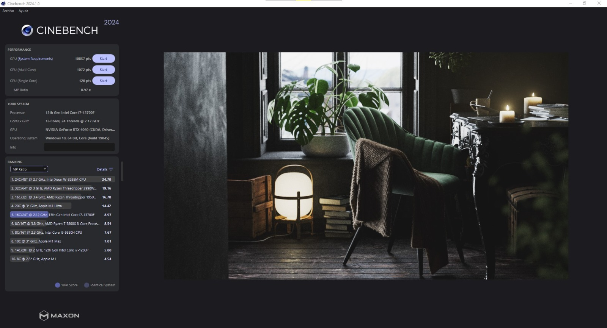

# Mini-guía para instalar Cinebench

## Para que sirve Cinebench

La finalidad de este benchmark es comprobar el rendimiento tanto de la CPU como de la GPU bajo de trabajo, y finalmente comparar los resultados con otros equipos gracias s la tabla que el propio programa integra.

## Proceso de instalación

El proceso de instalación es muy sencillo, solo tienes que ir a la página oficial de [Cinebench](https://www.maxon.net/en/cinebench), descender un poco y darle a download from maxon:

Ahora se le da al botón de descarga de la página a la que te redirijió la anterior, eligiendo la versión que se ajuste al sistema operativo:

Al darle a download, se descargará un zip que contiene el programa para poder ejecutarlo:

Al hacer click en el archivo .exe ya se iniciará el programa y estará listo para usar.

## Uso básico

Al abrir el programa, nos encontramos con las opciones para iniciar las pruebas junto con información del sistema y un ranking con puntuación de otros componentes:

Al hacer click en cualquiera de los dos botones de start se inicia la prueba que da un valor numérico como resultado, a mayor valor, mejor rendimiento:

