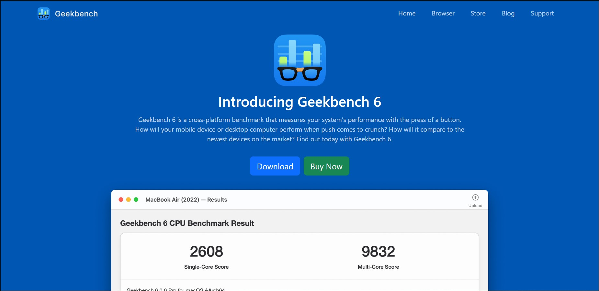

# Mini-guía para instalar Geekbench

## Para que sirve Geekbench
Geekbench es un benchmark que permite comprobar como se comportan los componentes de tu equipo bajo cargas normales de trabajo. Poniendo a prueba tu CPU con cargas similares a cuando revisas el correo, escuchas música o ambas cosas al mismo tiempo. Además puedes poner a prueba tu GPU en tareas como gaming o edición de video. POr último, Geekbench usa escenarios del día a día lo que lo vueve muy útil al ofrecer resultados relevantes para el usuario promedio.

## Proceso de instalación
El proceso de instalación es muy sencillo, solo tienes que ir a la página oficial de [Geekbench](https://www.geekbench.com), y darle a download:

Ya aquí seleccionas la plataforma para la que quieras descargarlo, y la seleccionas:

Con el instalador descargado solo falta hacerle click y seguir todos los pasos que el instalador va dando al usuario, como elegir donde instalarlo:

 O si quiere crear un shortcut:

 
 Y la instalación ya estaría completa.

 ## Uso básico
Al abrir el programa, esto es lo que verás:

Y ya solo queda seleccionar el test que se quiera realizar ya sea de GPU o de CPU. Una vez finalizado, por ejemplo, el de CPU, se abrirá una página en el navegador con la puntuación del procesador. Este programa usa de referencia el resultado de un i7-12700, que son 2500 puntos, a mayor puntuación, mejor será el rendimiento:

Además también se detallan cada una de las pruebas a las que se ha sometido el componente del equipo. Para el test de la GPU, también se abre una página en el navegador para el resultado y se aplica el mismo principio, a mayor puntuación, mejor rendimiento:
