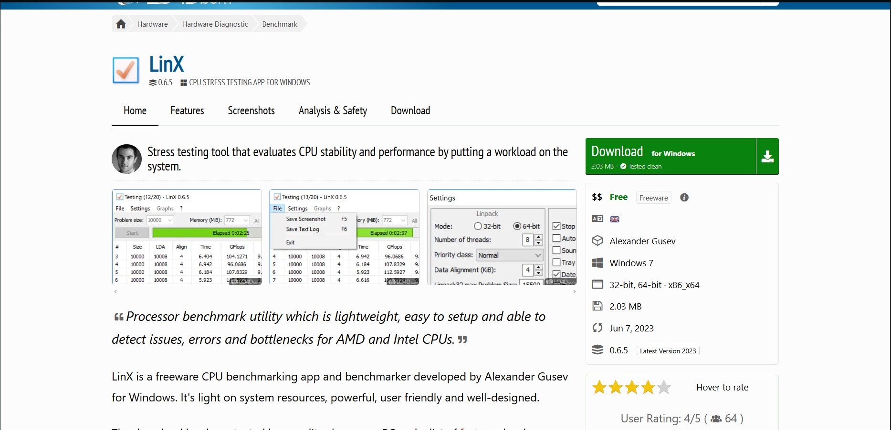
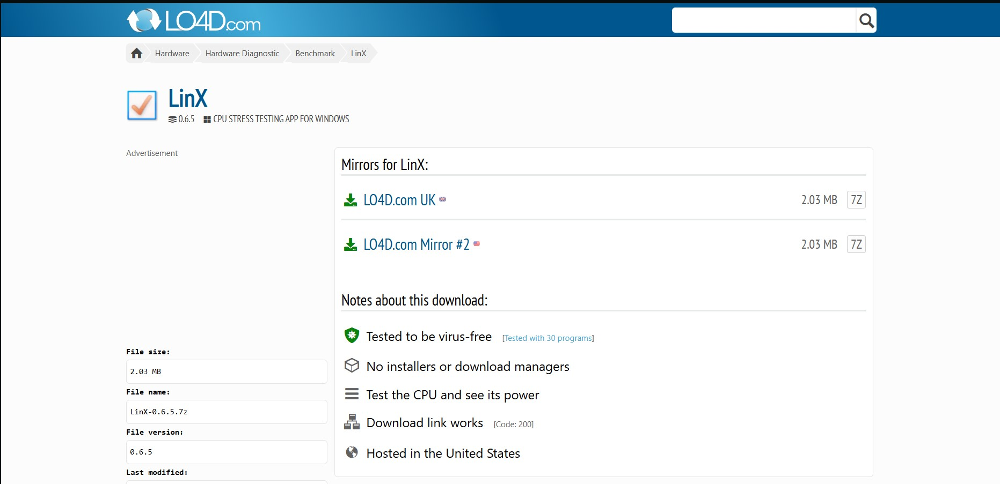
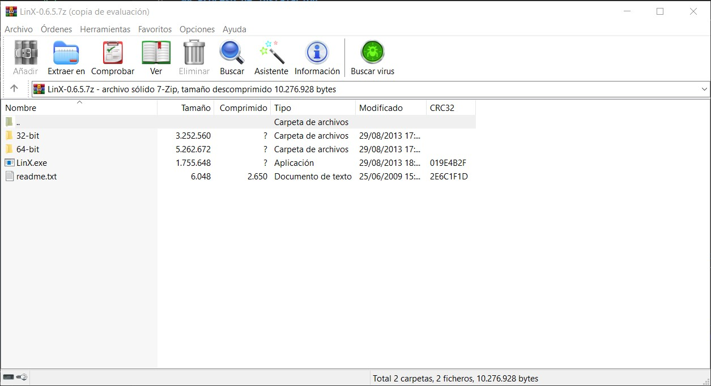
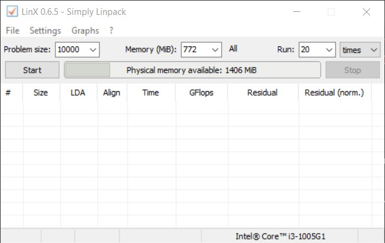
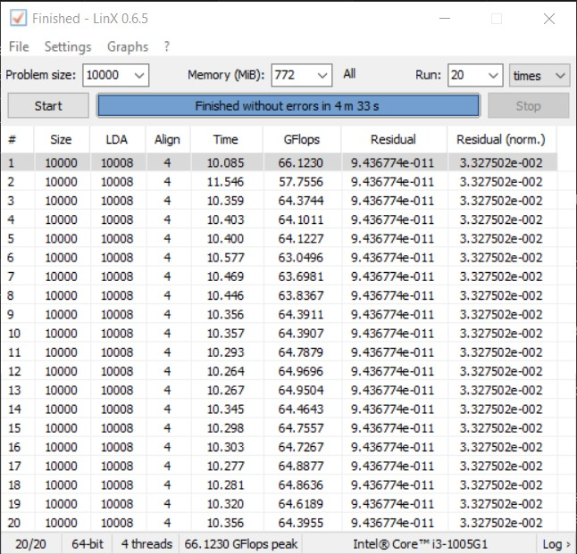

# Mini-guía para instalar LinX

## Para que sirve LinX

La herramienta LinX está diseñada para, haciendo uso de una interfaz simple, permitir al usuario realizar un benchmark cuya finalidad es comprobar la estabilidad del sistema y detectar errores de hardware. Esta herramienta se centra en comprobar e correcto funcionamiento conjunto de la CPU y la memoria RAM.

## Proceso de instalación

El proceso de instalación es muy sencillo, solo tienes que ir a la página oficial de [LinX](https://linx.en.lo4d.com/windows), y darle a download:

Ya aquí seleccionas el servidor del que quieras descargarlo y el .zip se descargará:

Con el .zip descargado solo falta hacerle click y dentro se encuentra el programa, junto con un readme y diferentes archivos:

Hacer click en el .exe ejecuta el programa por lo que no es necesario realizar instalación, solo descargar el programa y a funcionar.

## Uso básico

Al abrir el programa, simplemente es necesario darle a start y ya comenzará el proceso de prueba. En caso de que todos los resultados coincidan, se confirma la estabilidad de la CPU, de no ser así, quiere decir que hay algún error debido a que el sistema no es capaz de dar el mismo resultado a la misma ecuación:

